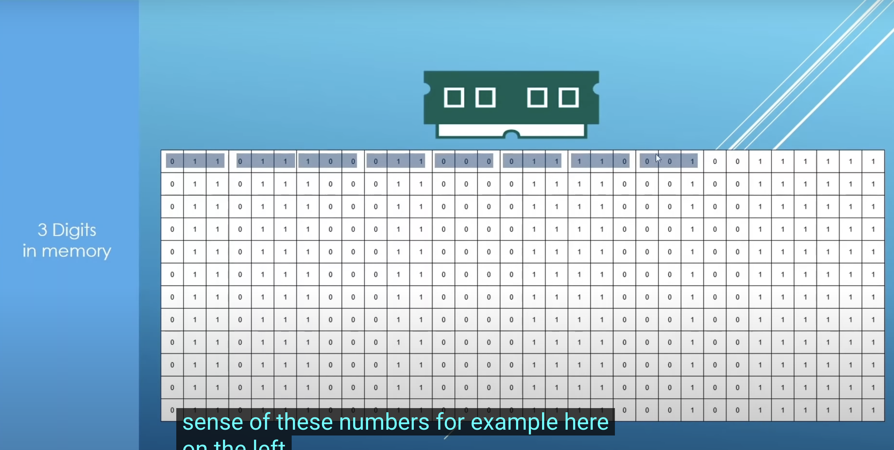
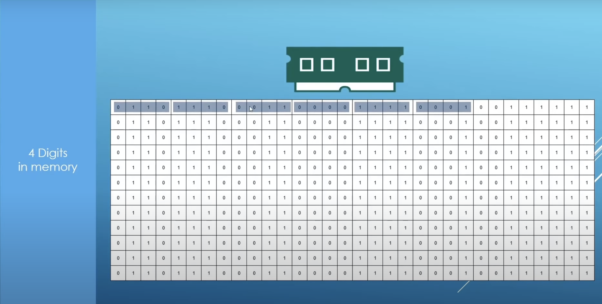

# CH 3 Variables And Data Types

# 3.2 Number Systems

Time : | 3h : 05m : 06s |
Code : | |
* [main.cpp](./main.cpp)
* [Home](/README.md)

---

## Introduction

>Number Systems
>* Binary
>* Octal
>* Hexadecimal

Number Systems allow us to Transform the data from the form that is really convenient for humans in a form that is convenient for computers in these ones and zeros or we use them to reverse zero and ones to human readable form.

### Base 10 Decimal System

||Number|Base 10 Representation|
|-|-|-|
| Base 10 | 2371 |2 x 103 + 3 x 102 + 7 x 101 + 1 x 100|
| Base 10 | 924  |9 x 102 + 2 x 101 + 4 x 100|
| Base 10 | 47   |4 x 101 + 7 x 100|

### Binary or Base 2

>Binary Number or Base Two : they have only two states or zero or one.

||Number|Base 2 Representation|
|-|-|-|
| Base 2 | 100101 |1 x 25 + 0 x 24 + 0 x 23 + 1 x 22 + 0 x 21 + 1 x 20|
| Base 2 | 10010 |1 x 24 + 0 x 23 + 0 x 22 + 1 x 21 + 0 x 2 0|
| Base 2 | 111 |1 x 22 + 1 x 21 + 1 x 20|

---

## Decimal And Binary

### 3 Digits Binary & Decimals

| Digits | Binary | Decimal |
|--------|--------|---------|
| Digit 3 | 000 | 0 |
| Digit 3 | 001 | 1 |
| Digit 3 | 010 | 2 |
| Digit 3 | 011 | 3 |
| Digit 3 | 100 | 4 |
| Digit 3 | 101 | 5 |
| Digit 3 | 110 | 6 |
| Digit 3 | 111 | 7 |

### 4 Digit Binary and Decimals

| Digits | Binary | Decimal |
|--------|--------|---------|
| Digit 4 | 0000 | 0 |
| Digit 4 | 0001 | 1 |
| Digit 4 | 0010 | 2 |
| Digit 4 | 0011 | 3 |
| Digit 4 | 0100 | 4 |
| Digit 4 | 0101 | 5 |
| Digit 4 | 0110 | 6 |
| Digit 4 | 0111 | 7 |
| Digit 4 | 1000 | 8 |
| Digit 4 | 1001 | 9 |
| Digit 4 | 1010 | 10 |
| Digit 4 | 1011 | 11 |
| Digit 4 | 1100 | 12 |
| Digit 4 | 1101 | 13 |
| Digit 4 | 1110 | 14 |
| Digit 4 | 1111 | 15 |

### 5 Digit Binar And Decimal

| Digits | Binary | Decimal |
|--------|--------|---------|
| Digit 5 | 00000 | 0 |
| Digit 5 | 00001 | 1 |
| Digit 5 | 00010 | 2 |
| Digit 5 | 00011 | 3 |
| Digit 5 | 00100 | 4 |
| Digit 5 | 00101 | 5 |
| Digit 5 | 00110 | 6 |
| Digit 5 | 00111 | 7 |
| Digit 5 | 01000 | 8 |
| Digit 5 | 01001 | 9 |
| Digit 5 | 01010 | 10 |
| Digit 5 | 01011 | 11 |
| Digit 5 | 01100 | 12 |
| Digit 5 | 01101 | 13 |
| Digit 5 | 01110 | 14 |
| Digit 5 | 01111 | 15 |
| Digit 5 | 00000 | 0 |
| Digit 5 | 00001 | 1 |
| Digit 5 | 00010 | 2 |
| Digit 5 | 00011 | 3 |
| Digit 5 | 00100 | 4 |
| Digit 5 | 00101 | 5 |
| Digit 5 | 00110 | 6 |
| Digit 5 | 00111 | 7 |
| Digit 5 | 01000 | 8 |
| Digit 5 | 01001 | 9 |
| Digit 5 | 01010 | 10 |
| Digit 5 | 01011 | 11 |
| Digit 5 | 01100 | 12 |
| Digit 5 | 01101 | 13 |
| Digit 5 | 01110 | 14 |
| Digit 5 | 01111 | 15 |
