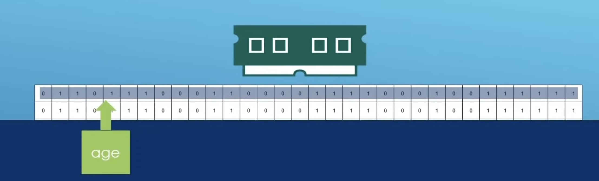
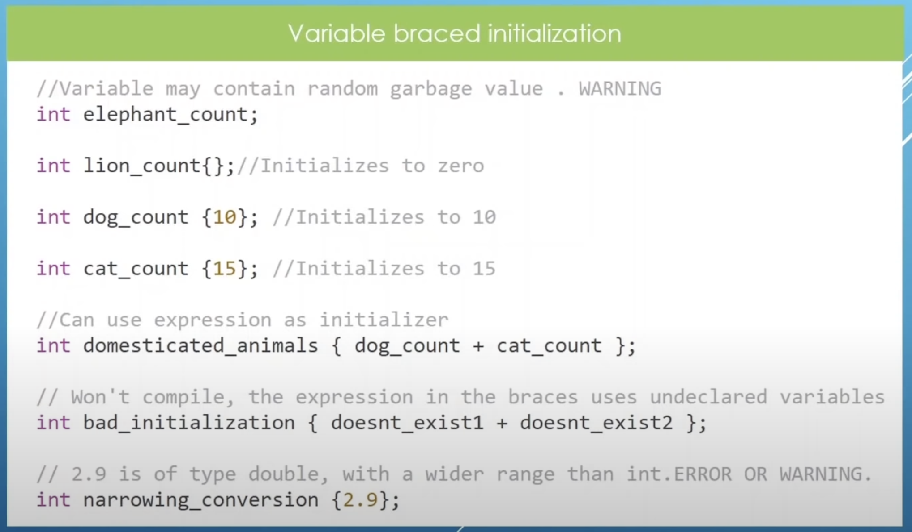
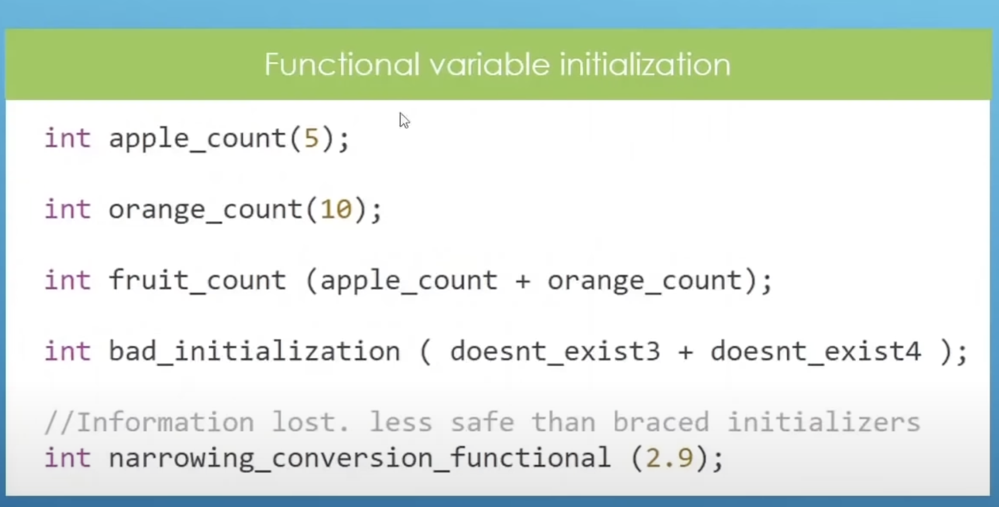
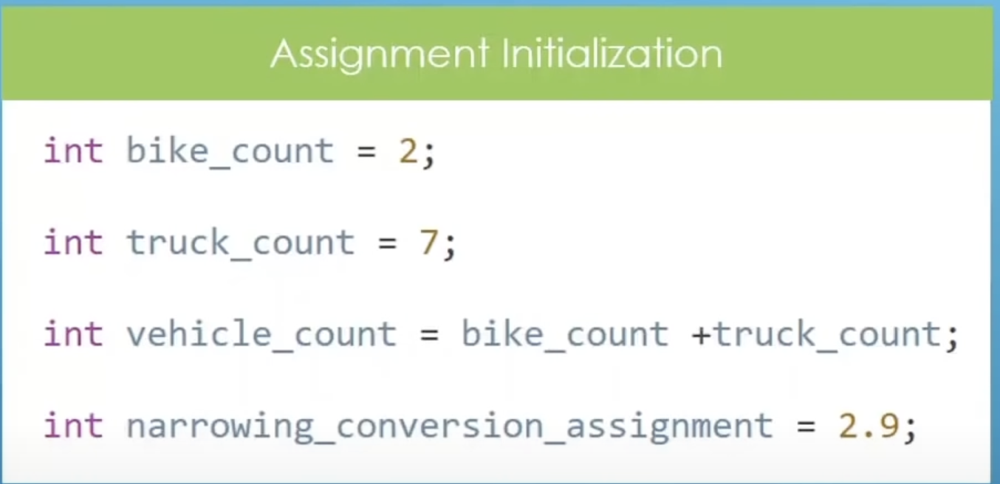
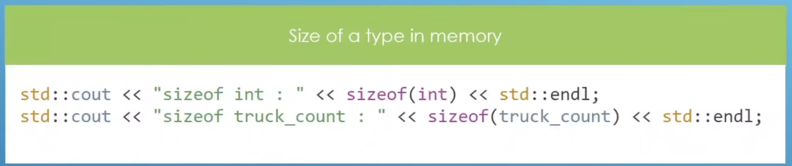
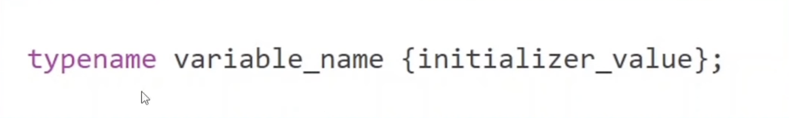

# CH 3 Variables And Data Types

# 3.3 Integers Type : Integer and Decimals

Time : | 3h : 21m : 53s |
Code : | 3H : 29M : 34S |
* [main.cpp](./main.cpp)
* [Home](/README.md)

---

## Integers

> `int`
>* Stores decimals
>* Typically occupies 4 bytes or more in memory
>* Integer in Memory

> Variable : A Named piece of memory that you use to store specific types of data.

---

## VARIABLE INITIALIZATION

* Braced Initialization
* functional initialization
* Assignment initialization

### Variable Braced initialization

### Functional Variable initalization

Result:

    3.3 Integers Type : Integer and Decimals Introduction 
     == == == == == == == == == == == == == == == == == == == == == == == == == == == == == 
    Apple Count : 5
    Orange Count : 10
    Total Fruit Count : 15
    Narrowing Conversion Function : 
     == == == == == == == == == == == == == == == == == == == == == == == == == == == == == 
Warning: 

    main.cpp:49:41: warning: implicit conversion from 'double' to 'int' changes value from 2.9 to 2 [-Wliteral-conversion]
        int narrowing_conversion_functional(2.9);
            ~~~~~~~~~~~~~~~~~~~~~~~~~~~~~~~ ^~~
    1 warning generated.

### Assignment Initialization

## Size of a Type in Memory

>representation of `int` in memory

## Variables

> Variable initialization
