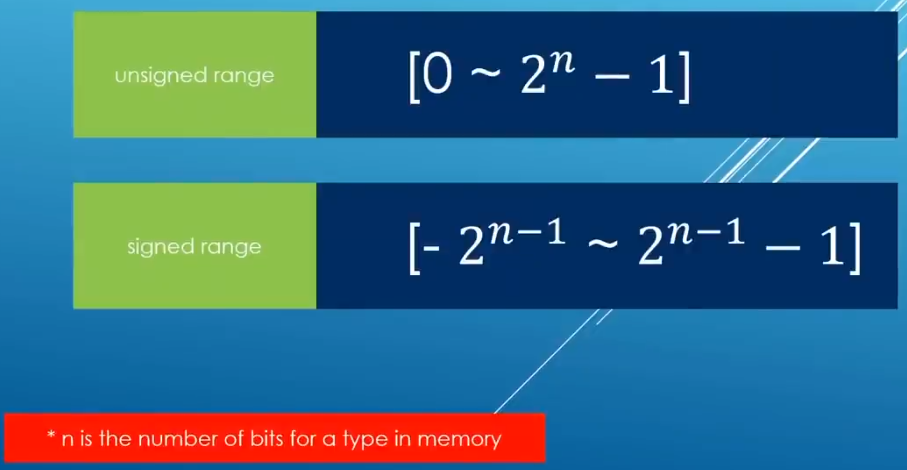
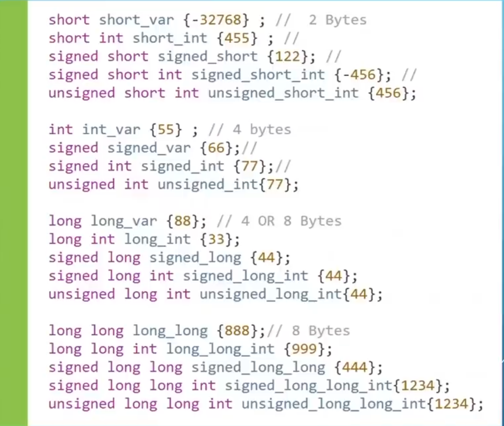

# CH 3 Variables And Data Types

# 3.4 Integer Modifiers

Time : | 3h : 40m : 45s |
Code : | 3h : 44m : 46s |
* [main.cpp](./main.cpp)
* [Home](/README.md)

---

## Positive And Negative Numbers

    >> int value1{10};
    >> int value2{-399}
    >> 
    >> signed int value1{10};
    >> signed int value2{-300};

> Note: `signed` or `unsigned` both store the same amount of data (4 bytes).

## short And Long 

Result: 

    3.4 Integer Modifiers
     == == == == == == == == == == == == == == == == == == == == == == == == == == == == == 
    VAlue 1 : 10
    VAlue 2 : -300
    sizeof(value1) : 4
    sizeof(value2) : 4
     short_var : -32768
     short_int : 455
     signed_short : 122
     signed_short_int : -456
     unsigned_short_int : 456
    -----------------
     : 55
    signed_var : 66
    signed_int : 77
    unsigned_int : 77
    -----------------
    long_var : 88
    long_int : 33
    signed_long : 44
    signed_long_int : 44
    unsigned_long_int : 44
    -----------------
    long_long : 888
    long_long_int : 999
    signed_long_long_int : 1234
    signed_long_long : 444
    unsigned_long_long_int : 1234
     == == == == == == == == == == == == == == == == == == == == == == == == == == == == ==
>Note:
>* `short int` can have memory storage of 2 byte And `long int` can have 8 bytes.
>* These modifiers only apply to integral types : those in which you can store decimal numbers

## Some code

    int value1{10};
    int value2{-300};

    std::cout<<"VAlue 1 : "<<value1<<std::endl;
    std::cout<<"VAlue 2 : "<<value2<<std::endl;
    std::cout<<"sizeof(value1) : "<<sizeof(value1)<<std::endl;
    std::cout<<"sizeof(value2) : "<<sizeof(value2)<<std::endl;
RESULT

    3.4 Integer Modifiers
     == == == == == == == == == == == == == == == == == == == == == == == == == == == == == 
    VAlue 1 : 10
    VAlue 2 : -300
    sizeof(value1) : 4
    sizeof(value2) : 4
     == == == == == == == == == == == == == == == == == == == == == == == == == == == == ==

### SIGNED INT

    signed int value1{10};
    signed int value2{-300};

    std::cout<<"VAlue 1 : "<<value1<<std::endl;
    std::cout<<"VAlue 2 : "<<value2<<std::endl;
    std::cout<<"sizeof(value1) : "<<sizeof(value1)<<std::endl;
    std::cout<<"sizeof(value2) : "<<sizeof(value2)<<std::endl;
RESULT:

    3.4 Integer Modifiers
     == == == == == == == == == == == == == == == == == == == == == == == == == == == == == 
    VAlue 1 : 10
    VAlue 2 : -300
    sizeof(value1) : 4
    sizeof(value2) : 4
     == == == == == == == == == == == == == == == == == == == == == == == == == == == == ==

### UNSIGNED INT

    unsigned int value3{4};
    unsigned int value4{-5};//! It gives an Error
RESULT: 

    >> main.cpp:27:25: error: constant expression evaluates to -5 which cannot be narrowed to type 'unsigned int' [-Wc++11-narrowing]
    >>     unsigned int value4{-5};//! It gives an Error
    >>                         ^~
    >> main.cpp:27:25: note: insert an explicit cast to silence this issue
    >>     unsigned int value4{-5};//! It gives an Error
    >>                         ^~
    >>                         static_cast<unsigned int>( )
    >> 1 error generated.
>Reson: Because `Unsigned int` Can't hold negative number so it gives an complie time error.

# Assignment
> find the size of all variable that have been used in this lesson.