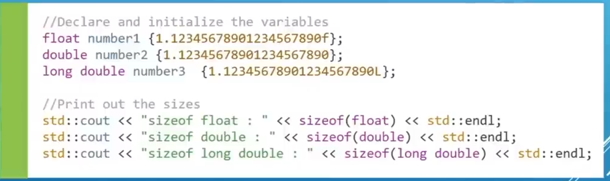
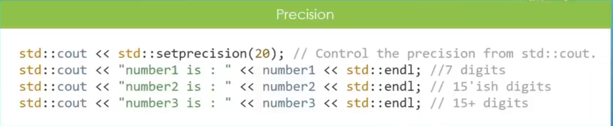
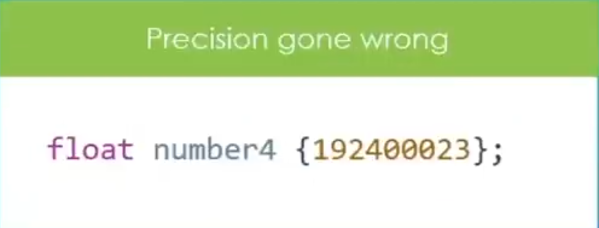
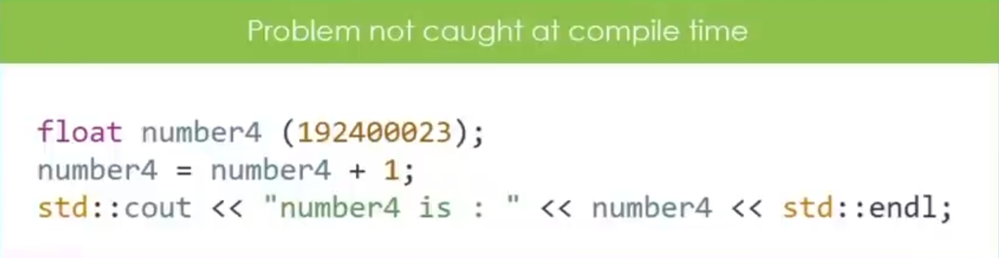
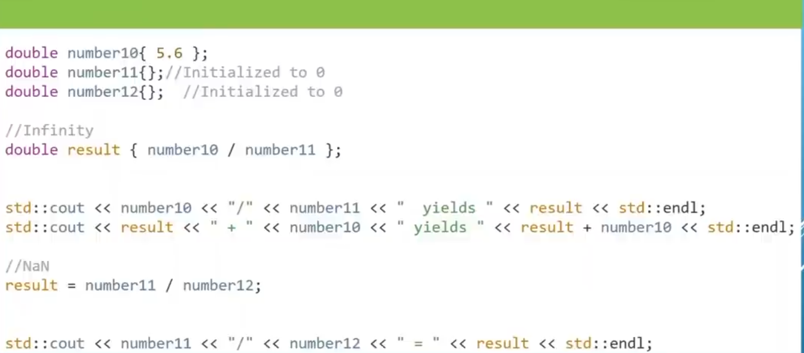
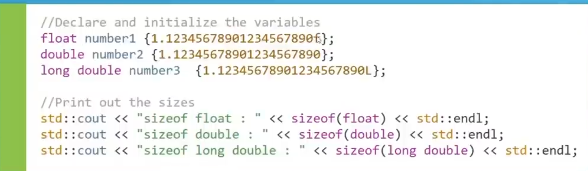

# CH 3 Variables And Data Types

# 3.5 Fractional Numbers

Time : | 3h : 54m : 02s |
Code : | 4h : 03m : 44s |
* [main.cpp](./main.cpp)
* [Home](/README.md)

---

## Floating Point Types

>* Used to Represent numbers with Fractional Parts in C++.

>* Precision: is numbers after decimal point.
> `1.23456789001` this number have 12 precision.

Precision:

Precision Gone Wrong

Scientific Notation

Floating Point Numbers In Memory

>Dont's 

>Dividing floting point Number with zero gives Infinity and dividing zero with zero gives NaN. So DOn't do it.

>* Remember the suffix when initializing floating point variables, otherwise the default will be double
>* Double works Well in many Situations so you will see it used a lot.
