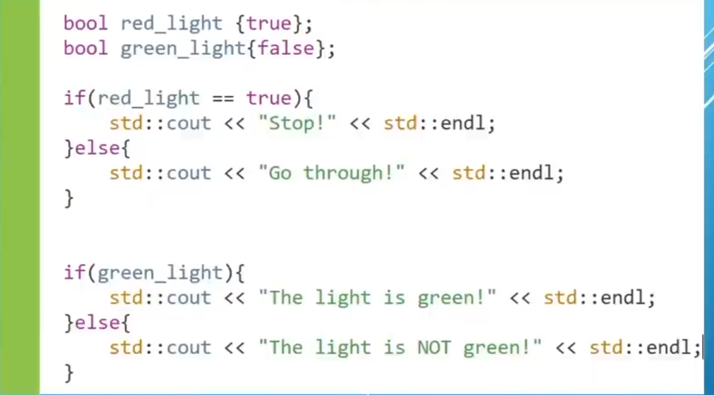
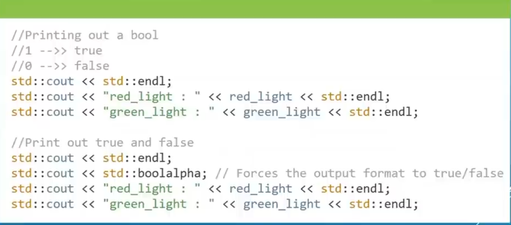

# CH 3 Variables And Data Types

# 3.6 Booleans

Time : | 4h : 16m : 40s |
Code : | 4h : 19m : 27s |
RemTime | 26h : 50m : 49s |
* [main.cpp](./main.cpp)
* [Home](/README.md)

---
 
Booleana : Can store two values `True` or `False`.
  
 

>* Booleans occupy 8 bit of Memory Or 1 Byte.
>* A byte can store 256 different values.
>* Using it just to cover two states (True/False) is wasteful, especially for device with hard memory constraints (think embedded devices).
>* There are techniques to pack even more data into a byte. we'll learn more about these in a few upcomming chapters.