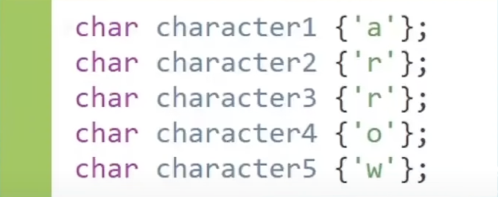
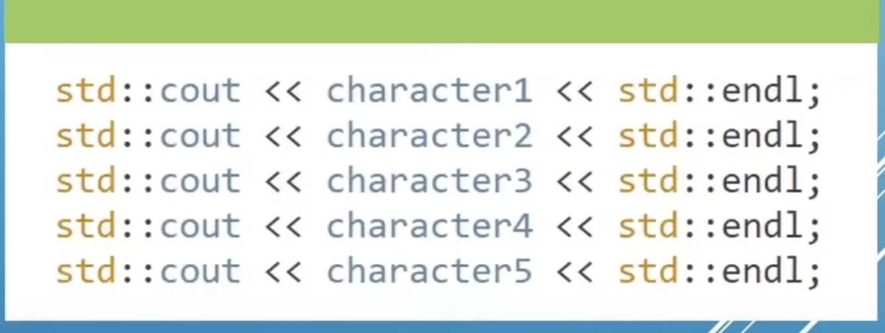
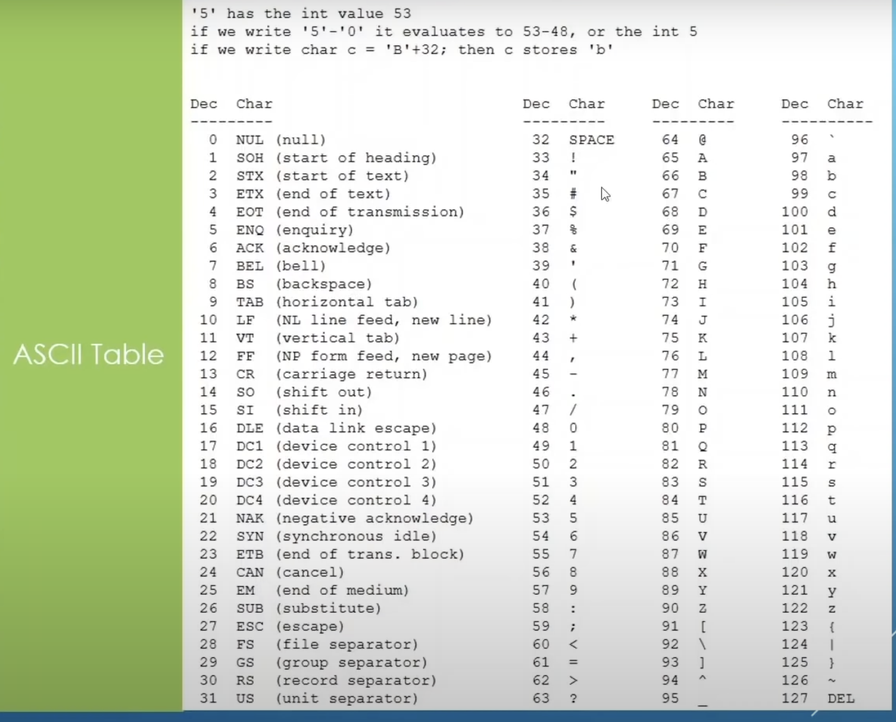
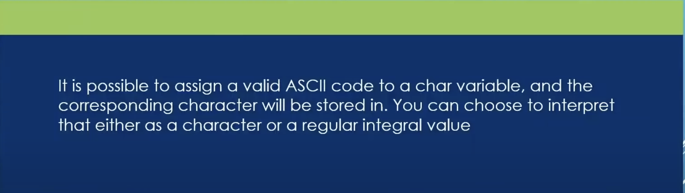
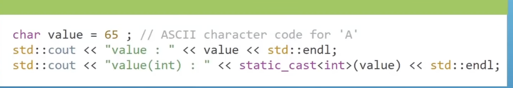

# CH 3 Variables And Data Types

# 3.7 Characters And Text
||Time (00H : 00Min : 00 Sec)|
|-|-|
 |Start Time           | 04H : 24Min : 51 Sec |  
 |Code  Time           | 04H : 28Min : 36 Sec |  
 |Left  Time           | 26H : 42Min : 37 Sec |  
* [main.cpp](./main.cpp)
* [Home](/README.md)

---

`char` occupy 1 Byte of Data

