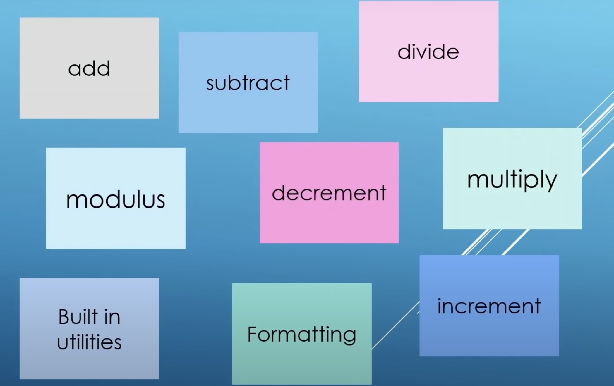

# Chapter 04 Operations On Data

## 4.1 Introduction

||Time (00H : 00Min : 00 Sec)|
|-|-|
 |Lesson Start           | 04H : 47Min : 01 Sec |  
 |Code Start             | 00H : 00Min : 00 Sec |  
 |Next Lesson            | 00H : 00Min : 00 Sec | 
* [main.cpp](./main.cpp)
* [Home](/README.md)

---

