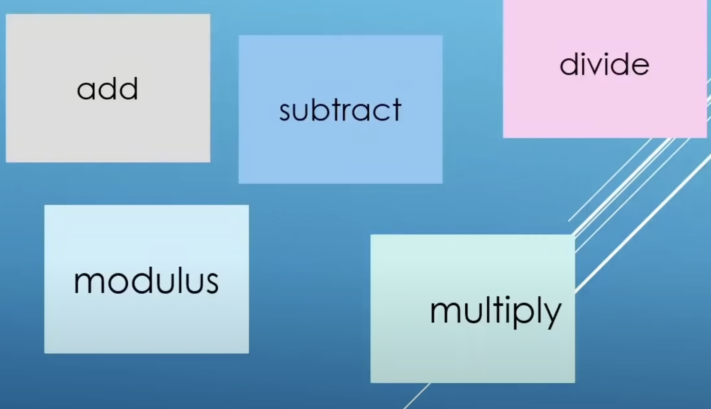
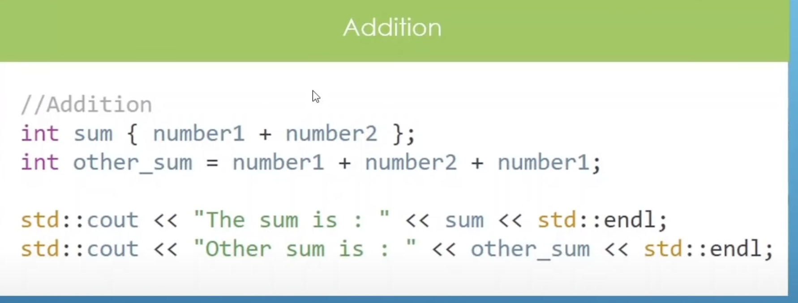
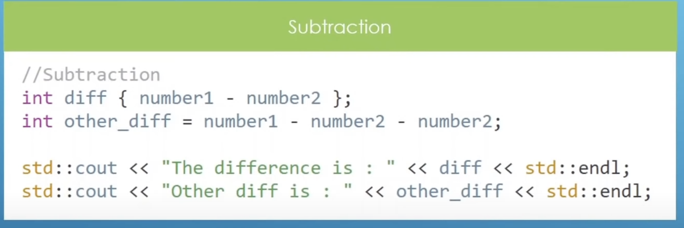
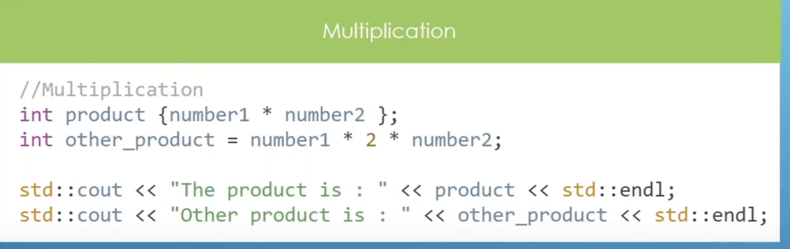
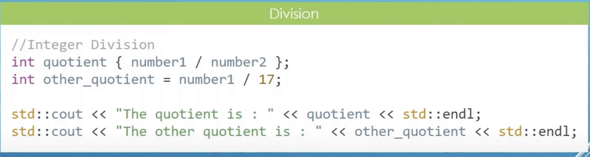
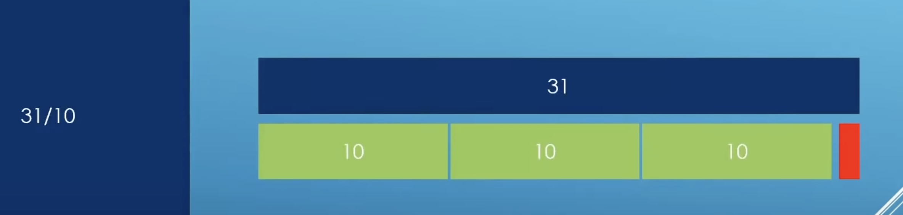
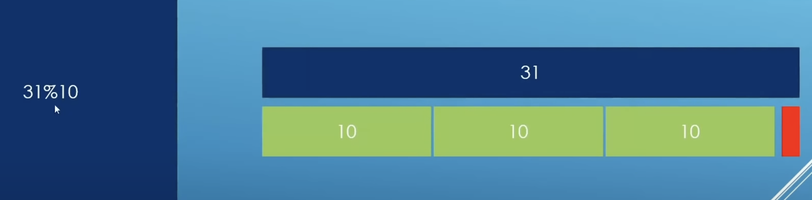

# Chapter 04 Operations On Data

## 4.2 Basic Operations

||Time (00H : 00Min : 00 Sec)|
|-|-|
 |Lesson Start           | 04H : 47Min : 34 Sec |  
 |Code Start             | 04H : 50Min : 36 Sec |  
 |Next Lesson            | 04H : 58Min : 04 Sec | 
* [main.cpp](./main.cpp)
* [Home](/README.md)

---

## Addition ' + '

## SubTraction ' - '

## MUltiplication ' * ' 

## Division ' / '

> 31/10 = 3 // you don't get Reminder 1 or in decimal

## Module Operator ' % '

>31 % 10 = 1 // It gives the reminder
