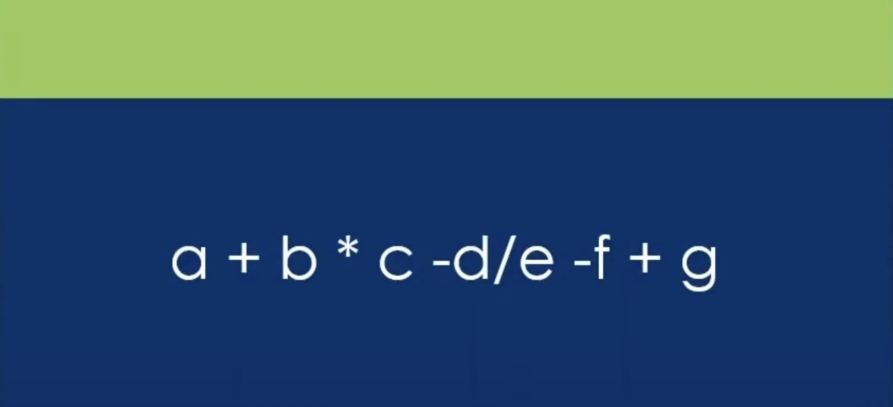
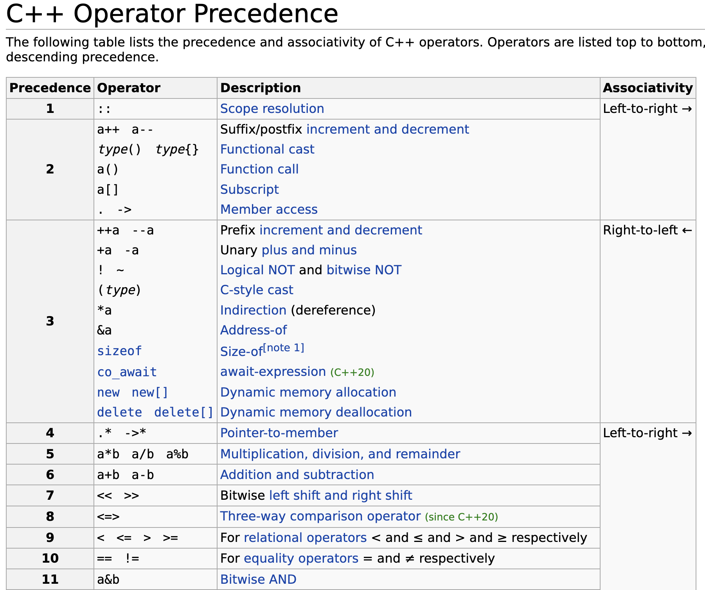
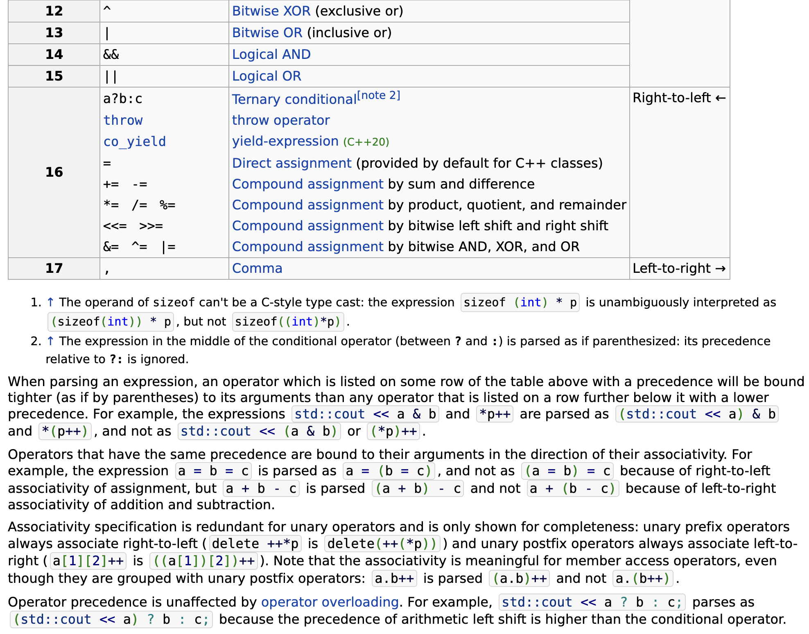
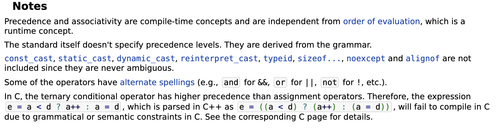
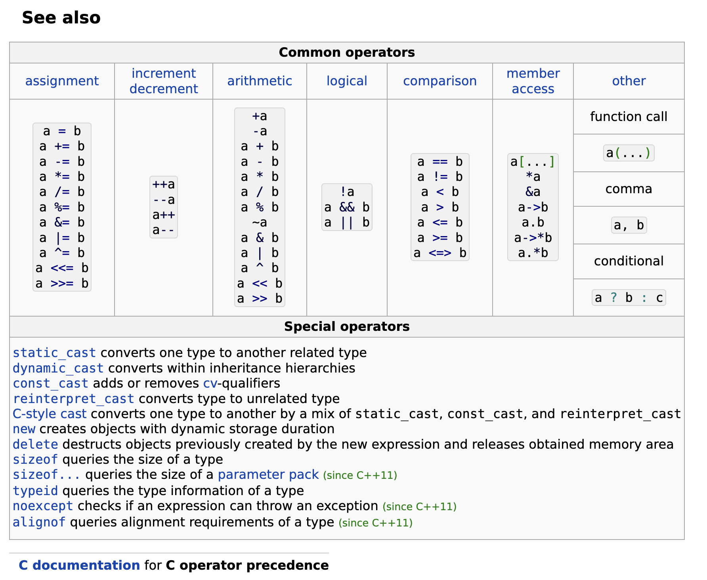

# Chapter 04 Operations On Data

## 4.3 Precedence And Associativity

||Time (00H : 00Min : 00 Sec)|
|-|-|
 |Lesson Start           | 04H : 58Min : 04 Sec |  
 |Code Start             | 05H : 01Min : 50 Sec |  
 |Next Lesson            | 05H : 12Min : 07 Sec | 
* [main.cpp](./main.cpp)
* [Home](/README.md)

---

rules To Handel multiple Expresstion

